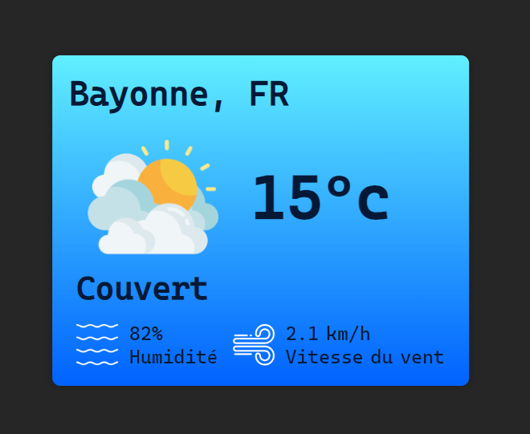

# Simplon_Weather_Application

## Preview

[Live Link](https://borisduko.github.io/Simplon_Weather_Application/)

## Technical Documentation

This app uses the apiKey from [openweathermap.com](<[https://](https://home.openweathermap.org/api_keys)>)
If application doesn't work with the provided apiKey - create a new one and insert in the
**js/meteo.js** file
`const apiKey = "your_apiKey";`

#### Config file

Located at **code/conf.json**
Insert city and language to display information:
`{
	"city": "bayonne",
	"lang": "fr"
}`
`{
	"city": "new york",
	"lang": "en"
}`

For French city names use dashes: _Mont-de-Marsan_, _Saint-Jean-de-Luz_
